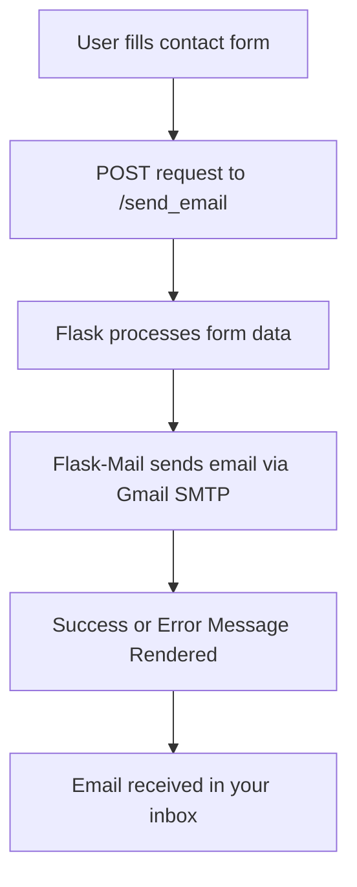

---


# 🪶 My Personal Blog — Powered by Flask

A clean, responsive, and dynamic **personal blog web app** built using **Flask**, designed to share thoughts, showcase projects, and connect through a beautiful contact section with real-time email integration.

---


## 🌟 Features

* 🏠 **Home Page** – Highlights recent posts and introduces the author.
* 🧠 **About Section** – Describes who you are and what your blog stands for.
* ✍️ **Blog Posts** – Displays posts stored in a MySQL database with dynamic rendering.
* 💬 **Contact Form** – Users can send you messages directly via email using Flask-Mail.
* 🎨 **Responsive UI** – Fully optimized for desktop and mobile screens.
* 🔐 **Secure Credentials** – All sensitive data stored safely using `.env` and `python-dotenv`.

---

## 🧩 Tech Stack

| Layer                      | Technology Used                     |
| -------------------------- | ----------------------------------- |
| **Frontend**               | HTML5, CSS3, Jinja2                 |
| **Backend**                | Flask (Python)                      |
| **Database**               | MySQL (can be replaced with SQLite) |
| **Email Handling**         | Flask-Mail, Gmail SMTP              |
| **Environment Management** | python-dotenv                       |

---

## ⚙️ Installation and Setup

Follow these simple steps to run the project locally 👇

### 1. Clone the repository

```bash
git clone https://github.com/rakshitbagait/code-alien.git
cd code-alien
```

### 2. Create a virtual environment

```bash
python -m venv venv
venv\Scripts\activate     # for Windows
source venv/bin/activate  # for macOS/Linux
```

### 3. Install dependencies

```bash
pip install -r requirements.txt
```

### 4. Create a `.env` file in the root directory

```bash
MY_EMAIL=youremail@gmail.com
MY_PASSWORD=your-app-password
```

> ⚠️ Use a **Google App Password** instead of your Gmail password.
> You can generate it here: [Google App Passwords](https://myaccount.google.com/apppasswords)

### 5. Run the Flask app

```bash
flask run
```

Now open your browser and visit
👉 **[http://127.0.0.1:5000/](http://127.0.0.1:5000/)**

---

## 🧠 Project Structure

```
blog/
│
├── app.py
├── .env
├── requirements.txt
├── static/
│   └── styles.css
│
├── templates/
│   ├── base.html
│   ├── index.html
│   ├── about.html
│   ├── contact.html
│   └── template.html
|   
│
└── README.md

```

---

## 💌 Contact Form Flow



---

## 📸 Screenshots

| Page    | Preview                                         |
| ------- | ----------------------------------------------- |
| Home    |        |
| About   |      |
| Contact |  |

*(Add screenshots of your actual site once deployed.)*

---

## 🚀 Deployment

You can deploy this Flask app easily using:

* [Render](https://render.com)
* [Railway](https://railway.app)
* [Vercel (with Python adapter)](https://vercel.com)
* [Heroku](https://heroku.com)

Make sure to set the same environment variables (`MY_EMAIL`, `MY_PASSWORD`) on your deployment platform.

---

## 👨‍💻 Author

**Rakshit Bagait**
💼 Developer | Blogger | Tech Enthusiast
📧 [Email Me](mailto:youremail@gmail.com)
🌐 [Portfolio Website](https://yourwebsite.com)
🐙 [GitHub](https://github.com/yourusername)

---

## 🪴 Copyright

This project is open to use but all the copyrights are reserved to Rakshit Bagait 

<html>&copy Rakshit Bagait </html>

---

